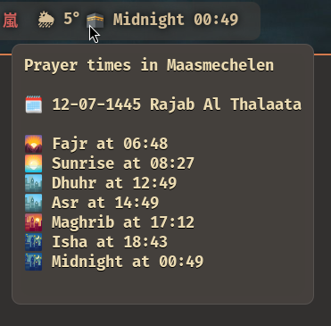

<h1 align="center">
prayerbar
</h1>

<p align="center">
a simple prayer time indicator for <a href="https://github.com/Alexays/Waybar/">Waybar</a> using <a href="https://aladhan.com/">aladhan.com</a>.
</p>
<p align="center">

</p>
<hr />

## Installation

Compile yourself using `cargo build --release`

## Usage

- `--city STRING` - pass a specific city location to aladhan.com
- `--country STRING` - pass a specific city location to aladhan.com
- `--method STRING` - pass a calculation method number. see [reference](https://aladhan.com/calculation-methods)
- `--ar` - display date in Arabic format.
---------------------------------------------------------------------
- `--ampm` - display time in AM/PM format ! in development

e.g. `prayerbar --city Brussels --country Belgium --method 15`

## Waybar configuration

Assuming `prayerbar` is in your path, it can be used like:

config.jsonc
```json
"custom/prayerbar": {
    "format": "{}",
    "tooltip": true,
    "interval": 60,
    "exec": "prayerbar",
    "return-type": "json"
},
```
style.css :
```css
#custom-prayerbar {
  padding: 0 1.5em 0 0.3em;
  border-radius: 0 10 10 0;
}
```
